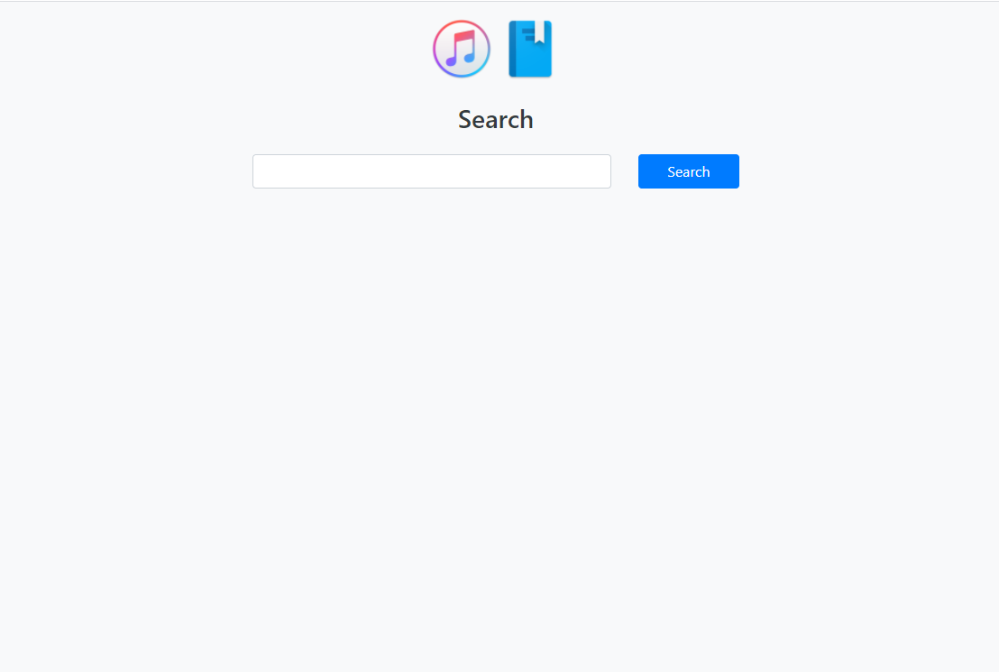
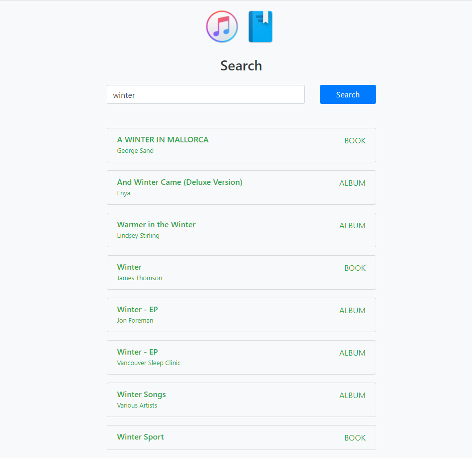

# Entertainment project
This repo provides a search of books and music albums using two famous APIs: Google Books API and iTunes Search API.


## Used tools
- [Java 8](http://www.oracle.com/technetwork/java/javase/overview/java8-2100321.html) as a programming language
- [maven](https://maven.apache.org) as a build system
- [Spring Boot](https://spring.io/projects/spring-boot) as a WEB framework
- [OpenFeign](https://github.com/OpenFeign/feign) as a client connector
- [Slf4j](https://maven.apache.org) as a logger
- [Logback](http://logback.qos.ch/) as a logs writer
- [Bootstrap](https://getbootstrap.com/) as a CSS library
- [Docker](https://www.docker.com) as an infrastructure manager

# Running the project
This project is supported by of all major browsers. However, Internet Explorer 9 and down is not supported.

This project is going to connect to [Google Book API](https://developers.google.com/books/docs/v1/reference/volumes/list) and [iTunes API](https://affiliate.itunes.apple.com/resources/documentation/itunes-store-web-service-search-api/#searching).

## Docker
### Using docker's image
To run the container in attached mode please use the following command with exposed port 8080:
```bash
docker run -it --rm -p 8080:8080 --name entertainment lesiakoval/entertainment:1.0.0
```

If you want to run in detached mode then please use:
```bash
docker run -itd --rm -p 8080:8080 --name entertainment lesiakoval/entertainment:1.0.1
```
And also to stop the container please run:
```bash
docker stop entertainment
```

To go to the application  web page you should use `http://localhost:8080/`.

### Health check
Docker container performs a health check for the application every 15 min with a timeout 60 sec.

## From source code
1. Clone the repo
2. Run the command `mvn spring-boot:run`
3. Go to `http://localhost:8080/` web page in your browser

## Configuration options
There are two properties which can be specified for maven build profiles depending on the environment:
- `itunes.api.result` maximum count of search result from iTunes API.
- `google.books.api.result` maximum count of search result from Google books API.

Currently, project has ony one `dev` maven build profile with predefined values `itunes.api.result=5` 
and `google.books.api.result=5`.

:exclamation: Be aware that these APIs have a restriction on the specified maximum count of search results. iTunes API allows defining a limit from `1` to `200` and Google Books API - from `1` to `40`. 

### Parameters to search within iTunes and Google Books
The following tables defines the parameter keys and values which were specified in `application.properties` file.

iTunes API
Name in property file | Parameter Key | Value | Description 
---|---|---|---
`itunes.api.max.result` | limit | 5 | The number of search results you want the iTunes Store to return. For example: 25.The default is 50.
`itunes.api.media` | media | music | The media type you want to search for. For example: movie. The default is all.
`itunes.api.entity` | entity | album | 	The type of results you want returned, relative to the specified media type. For example: movieArtist for a movie media type search. The default is the track entity associated with the specified media type.
`itunes.api.attribute` | attribute | albumTerm | The attribute you want to search for in the stores, relative to the specified media type.

Google Books API
Name in property file | Parameter Key | Value | Description 
---|---|---|---
`google.books.api.max.result` | maxResult | 5 | Maximum number of results to return. Acceptable values are 0 to 40, inclusive.
`google.books.api.printType` | printType | books | 	Restrict to books or magazines. Acceptable values are: all, books, magazines.
`google.books.api.key` | key | <key value> | This key is unique for each project and it is required to add to each request.

:exclamation: To able to use Google API this project uses a unique API key that was generated on `https://developers.google.com/`.

## Logging
All logs files are available in `<project dir>/logs` path.

# Application pages
## Main screen


## Search action on main screen

